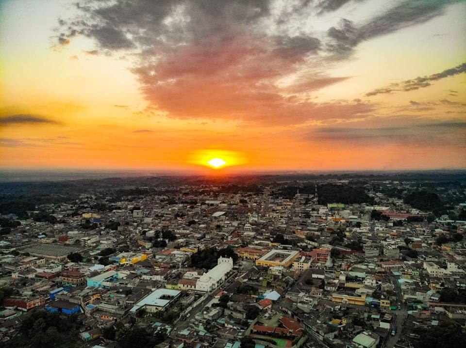
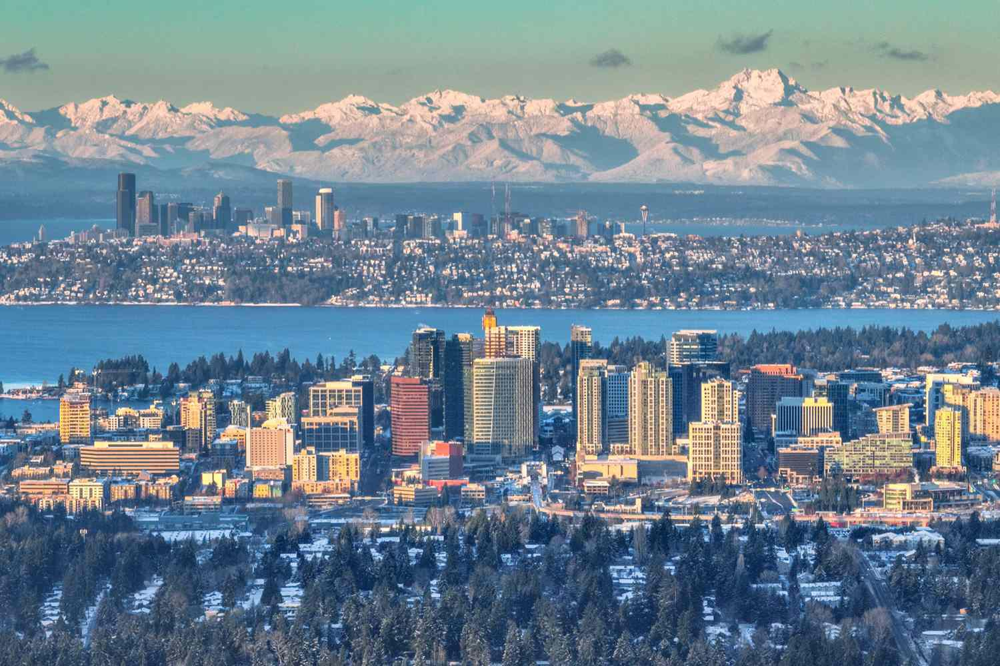
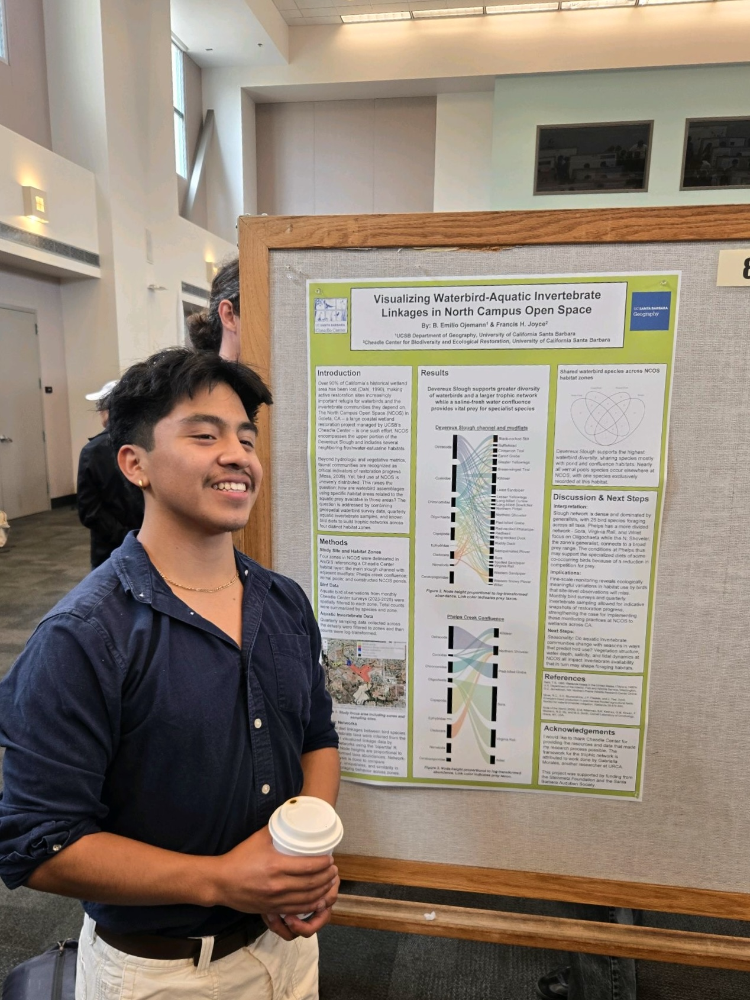
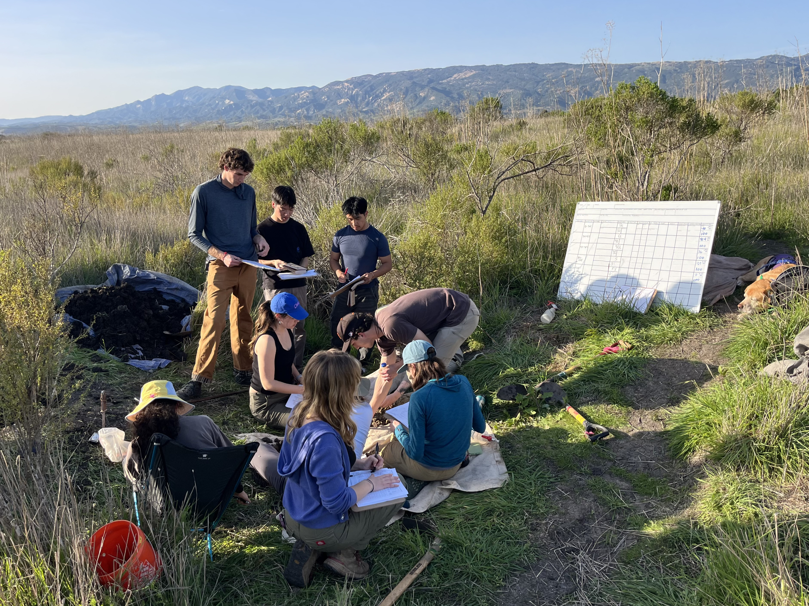

Read about who I am and what keeps me going outside of the lab.

##### Where I'm From

I was born in the beautiful city of Mazatenango, Guatemala before permanently relocating to Seattle, Washington.

{width=51%} {width=45%}

Growing up in Seattle largely shaped who I am today. I was lucky to have been surrounded by the towering Cascade Range, lush evergreen forests, strong rivers, and dramatic coastlines. I have always drawn to the outdoors, and this connection is a big reason for why I ended up studying the environment.

---

##### What I'm doing at UCSB

I am currently working towards two degrees at UC Santa Barbara: one in **Hydrology** and the other in **Physical Geography**. The trajectory of my academic and professional path is guided by an obsession with water and my experiences exploring the diverse California landscapes. On the hydrology side, I've worked through coursework covering ground and surface water systems, soil science, and policy governing the management of these resources. On the geography side, I've completed two full GIS series where I built up technical skills in spatial analysis, cartography, and remote sensing in ArcGIS, Google Earth Engine, and Python. 

Beyond the coursework, I am a **Student Research Lead** at the university's [Cheadle Center for Biodiversity and Ecological Restoration](https://www.ccber.ucsb.edu), where I conduct ecological research, work with interns, and contribute to wetland restoration at the North Campus Open Space (NCOS). 

{width=35%}
{width=62%}

--- 

##### Hobbies

When I'm not in the field or staring at satellite imagery, you'll probably find me on a nearby pitch, playing ultimate frisbee. I've played competitively since middle school, and now lead a UCSB club team to victory as a captain. It is among my favorite ways to relieve stress, connect with people, and occasionally hit the grass for a layout!

