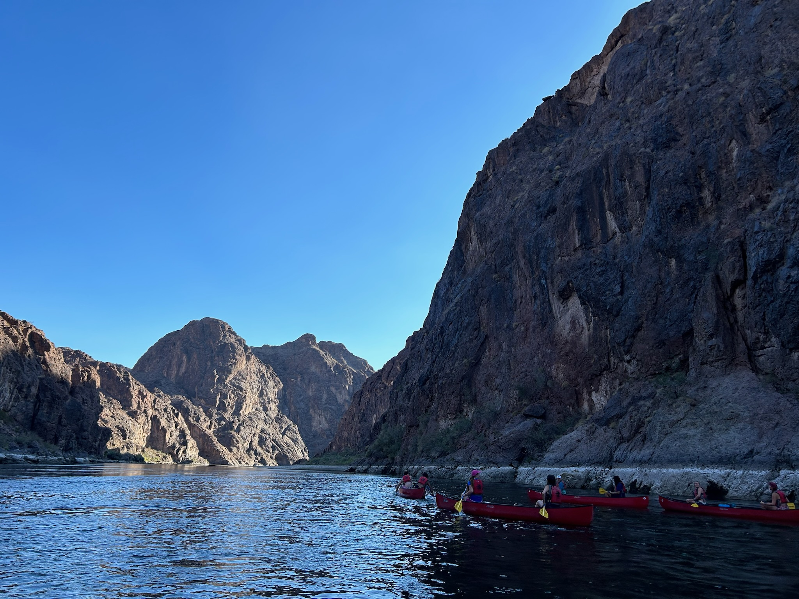
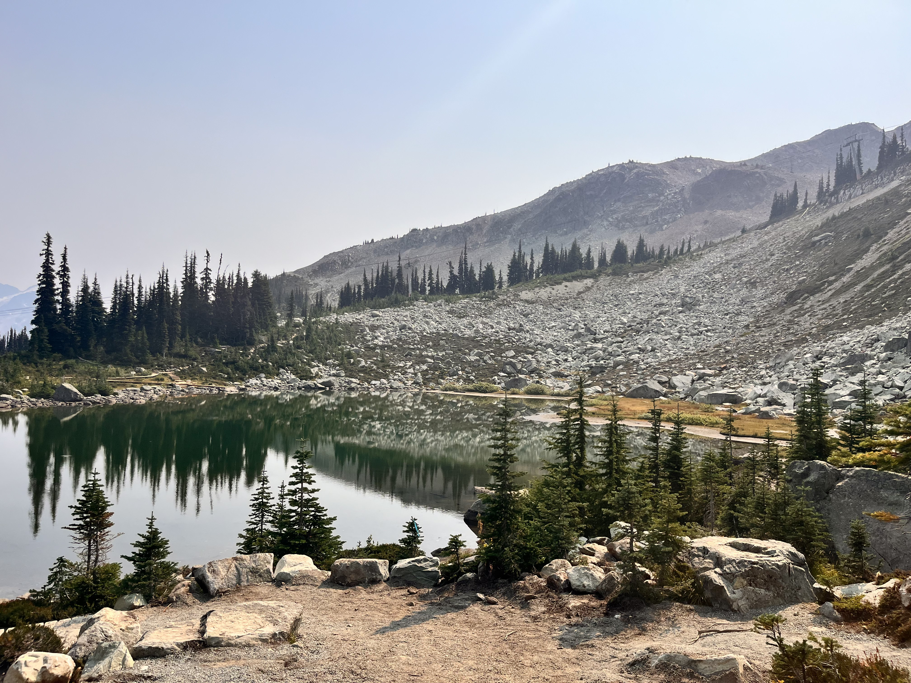
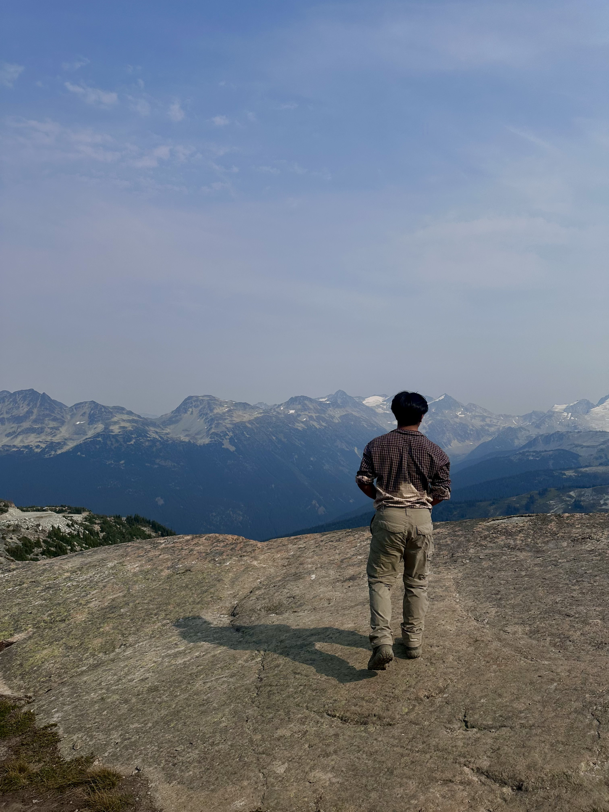
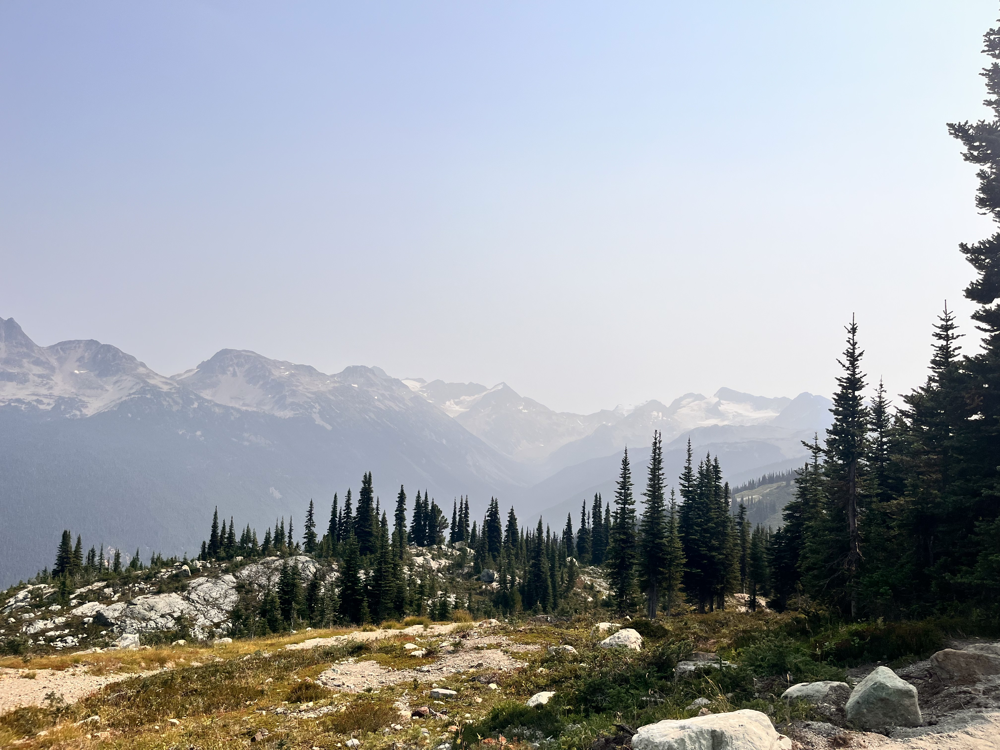

I spend lots of my time thinking about the environment in an academic context. But, my most formative experiences with nature have less to do with lab deadlines or a GIS software, and more reminding myself of its real-life beauty. Here are some outdoor trips that have stuck with me, and I would highly recommend!

---

### Canoeing the Colorado River
###### October 2023 | UCSB Adventure Programs

This one was equal parts adventure and personal development. I went as a part of the Leadership Training Course, an outdoor program offered by UCSB Recreation to students looking to become certified trip leaders. The group and I took a multi-day canoe trip down the part of Colorado River splitting Nevada and Arizona states. We visited the Hoover Dam, developed proper paddling technique, and soaked in hot springs along the way. The trip ended with an early 6am push to get back to Santa Barbara in time for class. With our headlamps strapped on, we found ourselves canoeing in nearly-pure darkness. That was easily one of the more surreal mornings of my life.

---

### Hiking Blackcomb Mountain, Whistler
###### September 2024 | Family Trip
{width=37%}
{width=23%}
{width=37%}

We started the morning with a gondola ride up to the mountain's trailhead, giving us time to grab brunch before the day hike. It was long, tiring, and at one point very questionably navigated... we were briefly lost. But, the views made the entire trip completely worth it, and the photos here don't do it justice. Surprisingly, Whistler in the middle of summer is still rather busy at the base, but your surroundings quickly get quiet once you are up high enough. There ended up being long stretches of the trail that we essentially had to ourselves. I gave the day a solid 5 out of 5 stars a year and a half ago, and would eagerly go back up tomorrow.

---

### Backpacking in Olympic National Park
###### July 2025 | Brothers Weekend

My two brothers and I backpacked into the Olympic backcountry, stopping at two sites before camping at Royal Lake. I can attest that this spot is indeed a "hidden gem." Though we lost the water filter somewhere along our trek up - so every drop of water ended up boiled over the stove - we survived. The nights there were the quietest I'd experienced in a long while. We played the guitar by a fire after every dinner, swam in the frigid alpine lake, and soaked in the blissful distance from our laptops. 

{width=49%} {width=49%}

