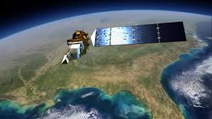
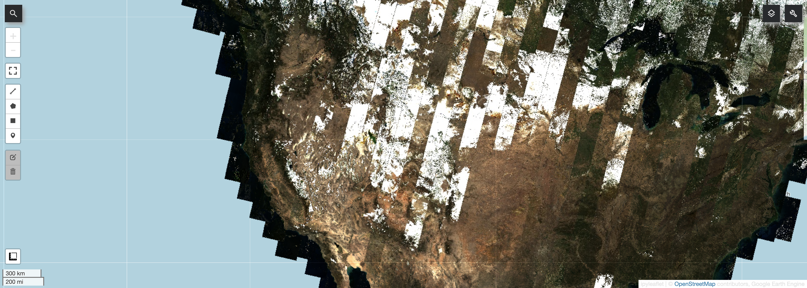
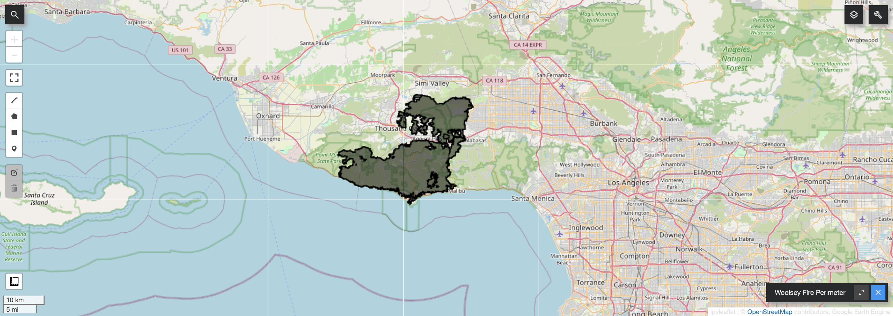
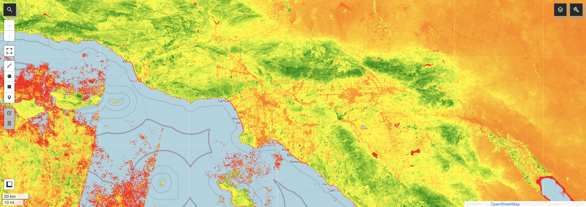
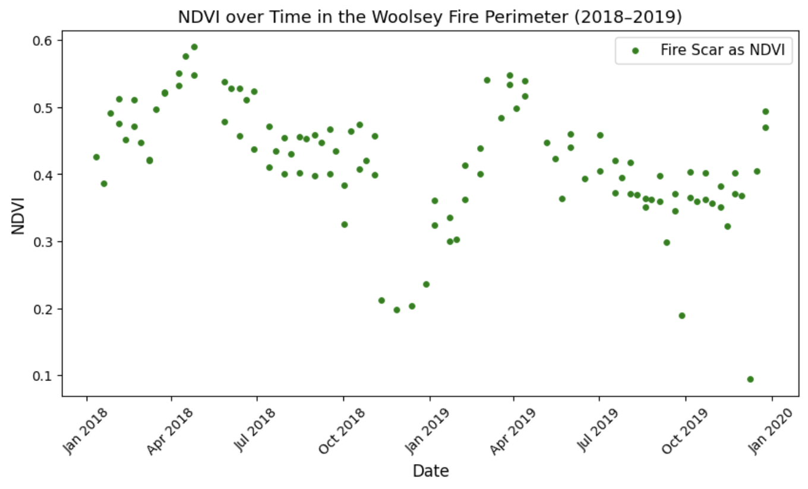
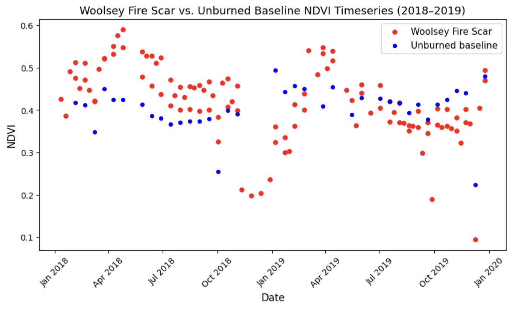
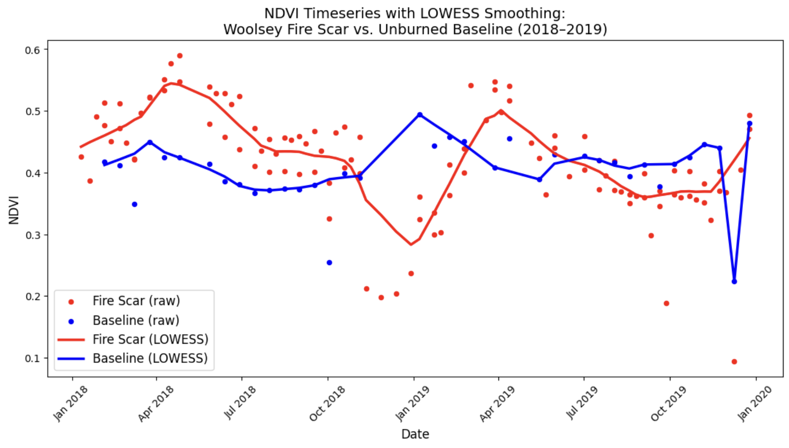

### Overview

One of the most powerful uses of satellite remote sensing is detecting how land cover changes over long periods time. One single image tells you what an area looks like today, but a time series generates the story of how it got there. In this lab, I used **Google Earth Engine (GEE)**, Landsat 8 imagery, and spectral indices to track vegetation change before and after the 2018 Woolsey Fire in Southern California.

In November 2018, the Woolsey Fire burned through roughly 97,000 acres across the Los Angeles and Ventura Counties, scorching the Santa Monica Mountains found between Thousand Oaks and Malibu. With a remote sensing background, I know a fire that large will leave a clear and highly-measurable signal in satellite data. The core skill applied here is **time series analysis**: pulling imagery across many dates, calculating a vegetation index for each image, and plotting how that index changes over time... all to track the fire's impact and the recovery of the landscape.

---

### What is Google Earth Engine?

Google Earth Engine is a free, cloud-based platform created specifically for analyzing satellite imagery. Normally, working with this kind of data means downloading huge files to a hard drive and hoping your computer can handle everything. But GEE fixes this: the user writes code that runs on Google's servers, right where all of the imagery already lives. As a result, you can analyze decades of global satellite data in mere seconds, and from any computer.

In this lab, I use GEE through Python using the `geemap` library, which lets you write Python code and visualize results as interactive maps inside a Google Colab notebook (No extra software needed!).

---

### Landsat 8

:::: {.columns}
::: {.column width="60%"}
Landsat is a joint NASA/USGS satellite program that has been continuously imaging Earth's surface since 1972. This makes it the longest continuous space-based record of Earth's land surface ever. Each satellite captures **multi-spectral imagery**, meaning it records light in multiple wavelength bands... beyond just visible colors. It captures near-infrared and shortwave infrared bands, and these are what makes advanced vegetation and water analysis possible.

In this lab I worked with **Landsat 8 Surface Reflectance**, which captures imagery at a 30-meter resolution with a 16-day revisit time.
:::
::: {.column width="40%"}

:::
::::

---

### Spectral Indices

Rather than analyzing raw band values, remote sensing scientists calculate **spectral indices**, or ratios of specific band combinations that highlight particular environmental features. The index used in this lab was:

**NDVI (Normalized Difference Vegetation Index)**

Calculated as `(NIR - Red) / (NIR + Red)`, applying NDVI to image pixels returns values range from -1 to 1. Healthy green vegetation reflects strongly in near-infrared and absorbs red light, producing high positive values. Bare soil, water, and developed areas produce values near zero or negative.

---

### Code Walkthrough

Here is the core workflow from the lab. Each step is annotated to explain what it does.

##### Step 1: Setup and Processing

Before calculating anything, raw Landsat imagery needs to be cleaned. Clouds, cloud shadows, and saturated pixels all introduce "noise" that would would impede analysis. I wrote a preprocessing function that applies quality assurance masks and scaling factors to every image in the collection automatically. Finally, I filtered the data to **2018 and 2019** to capture pre-fire and post-fire conditions.

```python
import ee

# Authenticate your Google account to access GEE
ee.Authenticate()
# Initialize with your project
ee.Initialize(project = "geog115c-spring2026")

# Mount Google Drive for saving figures
from pathlib import Path
from google.colab import drive
drive.mount('/content/drive')

out_dir = Path('/content/drive/MyDrive/GEOG 115C')
out_dir.mkdir(exist_ok=True)

# Load Landsat 8 surface reflectance imagery for all of 2018 and 2019
!pip install geemap
import geemap

dataset = ee.ImageCollection('LANDSAT/LC08/C02/T1_L2').filterDate(
    '2018-01-01', '2019-12-31'
)

# Preprocessing function: masks bad pixels and applies scaling factors
def preprocess_landsat8(image):
    # QA masks
    qa_mask = image.select('QA_PIXEL').bitwiseAnd(int('11111', 2)).eq(0)
    # Each 1 in the above line corresponds to each bitmask value (i.e., Fill,
    # Dilated Cloud, Cirrius (high confidence), Cloud, and Cloud Shadow). The 2
    # tells us to interpret this as a base-2 (binary) number. The eq(0) indicates
    # we only want to include the highest value data (i.e., where those bitmask
    # values are equal to 0; eq(1) would indicate the poor quality data. In doing this,
    # eq(0) ensures we only keep pixels where NONE of these flags are noted).
    saturation_mask = image.select('QA_RADSAT').eq(0)

    # Apply scaling factors to raw DN
    optical = image.select('SR_B.*').multiply(0.0000275).add(-0.2)
    thermal = image.select('ST_B.*').multiply(0.00341802).add(149.0)

    return (
        image
        .addBands(optical, None, True)
        .addBands(thermal, None, True)
        .updateMask(qa_mask)
        .updateMask(saturation_mask)
    )

visualization = {
    'bands': ['SR_B4', 'SR_B3', 'SR_B2'],
    'min': 0.0,
    'max': 0.3,
}

# Apply preprocessing to every image in the collection
image = dataset.map(preprocess_landsat8)

# Visualize as a true color composite to confirm data loaded correctly
m = geemap.Map()
m.set_center(-114.2579, 38.9275, 8)
m.add_layer(image, visualization, 'True Color')
m
```



---

##### Step 2: Define the study area

Rather than spending an hour to delineate a study area by hand, I loaded a publicly available **Woolsey Fire boundary** as a GeoJSON file from CAL FIRE. A GeoJSON is a standard file format that geographers use to store vectors (points, lines, polygons) as plain text that both humans and code can read.

I used the `geopandas` library to read the file and `geemap` library to convert it into a GEE geometry object. From there, I was able to clip all of the analysis to only the burned area.

```python
import geopandas as gpd

# Path to the Woolsey Fire GeoJSON stored in Google Drive
geojson_path = '/content/drive/My Drive/Colab Notebooks/Geog115c_2026/geojsons/'
geojson = geojson_path + 'Woolsey_Fire.geojson'

# Read the GeoJSON into a spatial dataframe
WoolseyFire_Perimeter = gpd.read_file(geojson)

# Convert to a GEE feature so we can use it
WoolseyFire_Perimeter_gee = geemap.geopandas_to_ee(WoolseyFire_Perimeter)

# Extract just the perimeter for clipping and analysis
woolsey_geom = WoolseyFire_Perimeter_gee.geometry()

# Visualize the fire perimeter on a map
map = geemap.Map()
map.addLayer(woolsey_geom, {}, 'Woolsey Fire Perimeter')
map
```



---

##### Step 3: Calculating NDVI and building time series

Now that the study area is defined, I moved on to calculate NDVI for every image in the collection and tracking how it changed over time within the burned area. The function `compute_timeseries` does a lot of the work here. For every image, it calculates the mean NDVI across all pixels within the fire perimeter, and stores that value along with the image's date... a time series! The result is a table of NDVI values paired with timestamps, called a feature collection. The visual here is a *median* composite image, confirming our NDVI function worked.

```python
# Defining an NDVI calculation function
def calc_ndvi(image):
    # Calculates NDVI from Landsat 8 SR bands and returns image with NDVI as
    # another band
    # NIR = SR_B5 and Red = SR_B4
    ndvi = image.normalizedDifference(['SR_B5', 'SR_B4']).rename("NDVI")
    return image.addBands(ndvi)

# Testing function on median image composite
median_image = image.median()
median_ndvi = calc_ndvi(median_image)

print("Median Image and Bands:", median_ndvi.bandNames().getInfo())

# Visualizing the median NDVI image
ndvi_vis = {
    "bands": ["NDVI"],
    "min": -0.2,
    "max": 0.8,
    "palette": ["red", "yellow", "green"]
}

m2 = geemap.Map()
m2.set_center(-118, 34, 9)
m2.add_layer(median_ndvi, ndvi_vis, "Median NDVI")
m2
```



```python
# Apply NDVI calculation to the entire image collection
ndvi_collection = image.map(calc_ndvi)

# compute_timeseries maps over each image independently, then uses reduceRegion
# to calculate mean NDVI within the ROI for that specific image, saving both
# the NDVI and image time values in an ee.Feature. The ee.FeatureCollection
# can then be used for a timeseries because it contains the date of each image.
def compute_timeseries(ImageCollection, region):
    def per_image(img):
        mean_dict = img.reduceRegion(
            reducer=ee.Reducer.mean(),
            geometry=region,
            scale=30,
            bestEffort=True
        )
        return ee.Feature(
            None,
            {
                'NDVI': mean_dict.get('NDVI'),
                'time': img.date().millis()
            }
        )
    return ee.FeatureCollection(
        ImageCollection.filterBounds(region).map(per_image)
    )

# Calling compute_timeseries for the Woolsey Fire perimeter
woolsey_timeseries = compute_timeseries(ndvi_collection, woolsey_geom)

# Converting to a useable dataframe
woolsey_df = geemap.ee_to_df(woolsey_timeseries)[["NDVI", "time"]]

print(woolsey_df.head())
print(f"\nRows: {len(woolsey_df)}")
```

---

##### Step 4: Analysis and Visualization

With the data in a pandas DataFrame, it was time to plot the time series.

```python
import pandas as pd
import matplotlib.pyplot as plt

# Converting time column to datetime
# "time" was stored in milliseconds, therefore unit = "ms"
woolsey_df["time"] = pd.to_datetime(woolsey_df["time"], unit = "ms")

# Drop rows missing NDVI
woolsey_df = woolsey_df.dropna(subset = ["NDVI"])

# Sort values by time
woolsey_df = woolsey_df.sort_values("time").reset_index(drop = True)

# Plotting NDVI v. time
fig, ax = plt.subplots(figsize=(10, 5))

ax.scatter(
    woolsey_df['time'],
    woolsey_df['NDVI'],
    s=15,
    color='green',
    label='Fire Scar as NDVI'
)

ax.set_xlabel('Date', fontsize=12)
ax.set_ylabel('NDVI', fontsize=12)
ax.set_title('NDVI over Time in the Woolsey Fire Perimeter (2018-2019)', fontsize=13)
ax.legend(fontsize=11)
ax.xaxis.set_major_formatter(plt.matplotlib.dates.DateFormatter('%b %Y'))
plt.xticks(rotation=45)

plt.show()
```



As you can see, the fire shows up clearly. NDVI inside the perimeter drops sharply in late 2018, then slowly starts climbing back through 2019 as vegetation starts to recover.

To give that drop some more context, I added a second time series from a nearby unburned area in the Santa Monica Mountains as a baseline to compare. If the fire caused a real change in vegetation, and not just normal seasonal variation, the two lines should dramatically diverge after the November 2018 date.

```python
# Defining a baseline geometry (unburned area in the Santa Monica Mtns)
baseline_geom = ee.Geometry.BBox(-118.5, 34.05, -118.35, 34.15)

# Calculate the NDVI timeseries for the baseline region
baseline_timeseries = compute_timeseries(ndvi_collection, baseline_geom)

# Convert to dataframe and clean
baseline_df = geemap.ee_to_df(baseline_timeseries)[["NDVI", "time"]]

baseline_df["time"] = pd.to_datetime(baseline_df["time"], unit="ms")
baseline_df = baseline_df.dropna(subset=["NDVI"])
baseline_df = baseline_df.sort_values("time").reset_index(drop=True)

# Plotting both timeseries together
fig, ax = plt.subplots(figsize=(10, 5))

ax.scatter(
    woolsey_df["time"],
    woolsey_df["NDVI"],
    s = 25,
    color = "red",
    label="Woolsey Fire Scar"
)
ax.scatter(
    baseline_df["time"],
    baseline_df["NDVI"],
    s = 18,
    color = "blue",
    label = 'Unburned baseline'
)

ax.set_xlabel("Date", fontsize = 12)
ax.set_ylabel("NDVI", fontsize = 12)
ax.set_title("Woolsey Fire Scar vs. Unburned Baseline NDVI Timeseries (2018-2019)",
             fontsize = 13)
ax.legend(fontsize = 11)
ax.xaxis.set_major_formatter(plt.matplotlib.dates.DateFormatter('%b %Y'))
plt.xticks(rotation=45)

plt.show()
```



Before the Woolsey fire, both areas track each other pretty closely through the year. After the fire, the burned area drops hard while the unburned baseline just keeps doing its thing. There are significant vegetation impacts from the fire. 

---

##### Step 5: LOWESS smoothing

Even with clean data, individual satellite images can still be thrown off by leftover haze, thin clouds, or other atmospheric noise. These show up as random spikes or dips in the scatter plot. To smooth them out, and without losing the raw data, I applied a technique called LOWESS (Locally Weighted Scatterplot Smoothing). It is essentially just drawing a best-fit line through the data, but not just one straight line across everything, the algorithm fits a bunch of smaller, local curves that follow the shape of the data more naturally. The `frac` parameter controls how tight those local fits are. Here, I used 0.15, meaning each smoothed point considers 15% of the surrounding data when fitting its curve.

```python
# Applying temporal smoothing

# Import LOWESS smoothing function
from statsmodels.nonparametric.smoothers_lowess import lowess

def lowess_smooth(df, var, frac=0.15):
    smoothed = lowess(
        endog=df[var],
        exog=df['time'].astype('int64'),
        frac=frac,
        return_sorted=False
    )
    return smoothed

# Applying the smoothing to create new columns in each dataframe
# (creating a smoothed NDVI timeseries)
woolsey_df["NDVI_smooth"] = lowess_smooth(woolsey_df, "NDVI")
baseline_df["NDVI_smooth"] = lowess_smooth(baseline_df, "NDVI")

fig, ax = plt.subplots(figsize = (13, 6))

# Raw data = points
ax.scatter(
    woolsey_df["time"],  woolsey_df["NDVI"],
    s = 19,
    color = "red",
    label = "Fire Scar (raw)"
)
ax.scatter(
    baseline_df["time"],
    baseline_df["NDVI"],
    s = 19,
    color = "blue",
    label = "Baseline (raw)"
)

# Smoothed = lines
ax.plot(
    woolsey_df['time'],
    woolsey_df['NDVI_smooth'],
    color = "red",
    linewidth = 2.5,
    label = "Fire Scar (LOWESS)"
)
ax.plot(
    baseline_df["time"],
    baseline_df["NDVI_smooth"],
    color = "blue",
    linewidth = 2.5,
    label = "Baseline (LOWESS)"
)

ax.set_xlabel("Date", fontsize = 12)
ax.set_ylabel("NDVI", fontsize = 12)
ax.set_title(
    "NDVI Timeseries with LOWESS Smoothing:\nWoolsey Fire Scar vs. Unburned Baseline (2018-2019)",
    fontsize = 14
)

# Legend and labels
ax.legend(fontsize = 12)
ax.xaxis.set_major_formatter(plt.matplotlib.dates.DateFormatter('%b %Y'))
plt.xticks(rotation = 45)

plt.show()
```



As you can see, the smoothed curves make the story easy to read. The fire scar NDVI abruptly crashes in late 2018, starts to recover through the 2019 spring, and gradually returns to baseline patterns from there. That unburned baseline shows expected seasonal changes throughout the whole period. This visual gave me confidence in saying that the vegetation loss inside the fire perimeter was real and caused by the fire itself, not just a normal part of the season.
