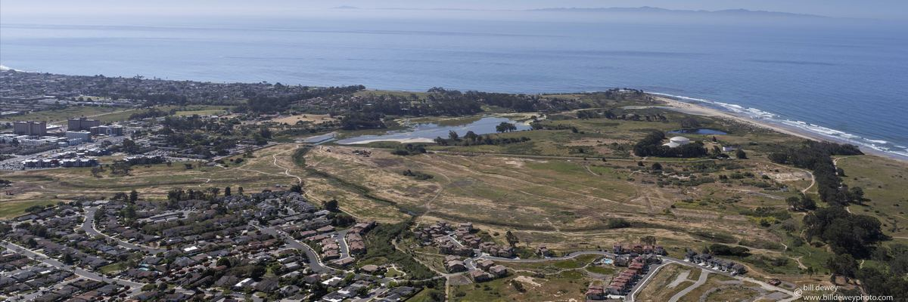

--- 

### Overview

The North Campus Open Space (NCOS) is an actively restoring estuary situated directly adjacent to the UC Santa Barbara campus. As a Student Research Lead at the Cheadle Center for Biodiversity and Ecological Restoration, I designed and led my own study investigating the spatial and trophic relationships between local waterbirds and aquatic invertebrates across four habitat zones in the upper arms of the Devereux Slough.

--- 

### The Question

As NCOS continues to restore its historic tidal connectivity and diverse, native habitats, a key ecological management question emerges: how are waterbirds and their invertebrate prey distributed across the wetland, and how do habitat zones influence those patterns? Getting a good understanding of these these linkages can directly inform restoration decisions such as deciding to prioritize habitat work

---

### Methods

To investigate these patterns, I combined monthly waterbird survey data with quarterly aquatic invertebrate sampling across four distinct habitat zones at Devereux Slough: the **main channel and its mudflats**, the **Phelps Creek confluence**, constructed freshwater **ponds**, and seasonal **vernal pools**. Each zone was ecologically distinct (different salinity gradients, water depths, and vegetation structures) despite being a part of the same restoration site. After linking the invertebrate community in each zone with published waterbird diets, I built trophic networks: visual maps of who is eating what, and where. All spatial analysis and network visualization were carried out in ArcGIS and R.

---

### Results

The main channel and mudflats support the greatest waterbird diversity at NCOS, with a dense, generalist-dominated network of 25 waterbird species feeding on 9 invertebrate taxa. The Phelps Creek confluence tells a different story: Rails and Willets specialize heavily on oligochaeta worms. This saline-freshwater junction may allow for reduced competition between specialicists and generalists as it creates such a unique niche. Overall, there is high overlap of waterbird species overlap across all four zones, with only the Wilson's Snipe recorded exclusively in vernal pools.

---

### Takeaways

- Food web structure, not just water presence, largely shapes how waterbirds use restored wetland habitats.

- Fine-scale habitat monitoring captures ecologically meaningful variation that broad site-level surveys miss entirely - something restoration managers at other natural reserves can directly work on.

---

[View full poster on eScholarship](https://escholarship.org/uc/item/1bc3t7fb)

**I presented my work at the UCSB Undergraduate Research and Creative Activities (URCA) poster colloquium on May 13, 2026.**

